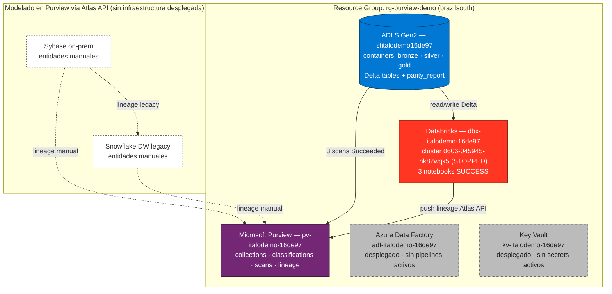

# Azure Purview Specialist — Proyecto de Preparación

Repo de preparación para la entrevista **Data Engineer — Azure Purview Specialist** en **Bluetab (grupo IBM)**.

Replica a escala reducida una arquitectura de gobernanza de datos sobre Azure usando **Microsoft Purview** como capa central de catalogación, clasificación y lineage sobre un pipeline de migración: **Sybase on-prem (origen legacy) → ADF Copy (vía SHIR) → ADLS Gen2 bronze/silver/gold (Delta) → Databricks (notebooks PySpark + SQL Warehouse) → Tableau**, en paralelo con el DW legacy **Snowflake** (que contenía los stored procedures originales que se migraron a notebooks). Mini-réplica del caso Colmena.

---

## Objetivo

Construir un proyecto **end-to-end demostrable** que cubra los requisitos de la JD:

- Configuración y administración de Azure Purview
- Políticas de clasificación y etiquetado de datos
- Best practices de gobernanza
- Integración Purview + Sybase (vía SHIR) + Snowflake (legacy) + ADF + Databricks + ADLS gold (tablas Delta)
- Uso de Data Map, Data Catalog y Data Estate Insights

---

## Arquitectura

```
                        ┌─────────────────────────────── LEGACY ────────────────────────────────┐
                        │                                                                       │
   ┌──────────────┐     │   ┌──────────────────────┐         ┌────────────┐                     │
   │  Sybase      │─────┼──►│  Snowflake (DW)      │────────►│  Tableau   │ ← apuntando a       │
   │  on-prem     │ (legacy)│  20+ SPs procesan    │ (legacy)│  dashboards│   Snowflake antes   │
   │  (origen)    │     │   │  tablas analíticas   │         │            │   de la migración   │
   └──────┬───────┘     │   └──────────────────────┘         └─────┬──────┘                     │
          │             └─────────────────────────────────────────┼─────────────────────────────┘
          │                                                       │
          │                                                       │ (repoint progresivo:
          │  ┌──── NUEVO (durante migración: dual-load) ─────┐    │  cada Delta validado
          │  │                                               │    │  se queda apuntando aquí)
          ▼  ▼                                               │    │
   ┌──────────────┐    ┌────────────────────────────────┐    │    │
   │  ADF Copy    │───►│  ADLS Gen2                     │    │    │
   │  + SHIR      │    │  bronze → silver → gold(Delta) │◄───┼────┼──┐
   └──────────────┘    └────────────────┬───────────────┘    │    │  │ lee Delta
                                        │ escribe            │    │  │ (sin copiar
                                        ▼                    │    │  │  datos)
                       ┌────────────────────────────────┐    │    │  │
                       │  Databricks workspace          │    │    │  │
                       │  ┌──────────────────────────┐  │    │    ▼  │
                       │  │ notebooks PySpark        │  │    │   ┌──────────────────────────┐
                       │  │ (ex-SPs Snowflake)       │  │    │   │ Databricks SQL Warehouse │
                       │  │ → escriben Delta gold    │  │    │   │ (compute engine SQL,     │
                       │  └──────────────────────────┘  │    │   │  no almacena datos)      │
                       └────────────────────────────────┘    │   └────────────┬─────────────┘
                                                             │                │ JDBC/ODBC
                                                             │                ▼
                                                             │       (Tableau apunta acá
                                                             │        cuando la tabla pasa
                                                             │        el gate de paridad)
        ┌────────────────────────────────────────────────────┘
        ▼
┌──────────────────────────────────────────────────────────────┐
│                  Microsoft Purview                           │
│  Data Map · Data Catalog · Data Estate Insights · Lineage    │
│  (cataloga TODO: Sybase via SHIR, Snowflake legacy,          │
│   ADLS bronze/silver/gold Delta, ADF, Databricks)            │
└──────────────────────────────────────────────────────────────┘
                          │
                          ▼
                  ┌──────────────┐
                  │  Key Vault   │
                  │  (secrets)   │
                  └──────────────┘
```

> **Nota sobre Databricks SQL Warehouse**: es un **motor de cómputo SQL** dentro del workspace de Databricks, no una capa de almacenamiento. Tableau se conecta vía JDBC/ODBC al SQL Warehouse, y éste ejecuta las queries directamente contra las tablas Delta que viven en ADLS gold. No hay movimiento ni copia de datos.

Ver detalle en [`docs/03_arquitectura.md`](docs/03_arquitectura.md).

---

## Demo desplegado en Azure (estado real)

El diagrama anterior es el **modelo conceptual** (caso Colmena completo). Lo que está efectivamente desplegado en Azure como demo es un subconjunto: las piezas on-prem y legacy (Sybase, Snowflake, SHIR, Tableau) se modelan como **entidades manuales en Purview vía Atlas API** para que el grafo de lineage se vea end-to-end, sin tener que levantar infraestructura legacy real.

### Recursos físicos en Azure

Resource group `rg-purview-demo` (región brazilsouth). Las cajas con borde sólido están **desplegadas en Azure**; las punteadas son **entidades modeladas en Purview vía Atlas API** (no hay infraestructura real detrás).



### Estado interno de Purview (poblado vía Atlas API)

```
COLLECTIONS (árbol 4 niveles)
└── root
    └── colmena
        ├── sales
        ├── underwriting
        └── claims

CUSTOM CLASSIFICATIONS (LATAM)
  CL.RUT  ·  CL.POLICY_NUMBER  ·  CL.CLAIM_NUMBER   (threshold 60%)

SOURCES + SCANS
  adls-italodemo-colmena
    ├── scan bronze  → Succeeded  (15 discovered / 5 classified)
    ├── scan silver  → Succeeded
    └── scan gold    → Succeeded

GLOSSARY: glosario Colmena + 5 términos ES

LINEAGE end-to-end (Atlas API)
  [Sybase entities manuales] ──► bronze ──► silver ──► gold
                            └─► [Snowflake entities manuales]   (path legacy)
  Total: 23 Process edges

TAGS de migración
  3 assets gold con customAttributes.migration_status=ready
  emitidos desde nb_dq_parity al pasar el gate de paridad
```

### Qué NO está desplegado (y por qué)

| Componente conceptual | Estado real | Razón |
|---|---|---|
| Sybase on-prem | entidad manual en Purview | el origen on-prem no se replica en una demo |
| Snowflake DW legacy | entidades manuales en Purview | costo y licenciamiento; el lineage legacy se modela vía Atlas |
| SHIR (Self-Hosted IR) | no aplica | no hay Sybase real que escanear |
| Tableau | no aplica | la demo termina en el catálogo (gold + lineage + tags) |
| ADF pipelines | recurso desplegado, sin pipelines activos | el flujo demo corre desde notebooks Databricks directamente |
| Key Vault secrets | recurso desplegado, vacío | tokens y keys viven en `demo/.secrets/` local (gitignored) |

### Scripts de ejecución (orden real corrido)

Todos en [`demo/scripts_exec/`](demo/scripts_exec/):

1. `pv_create_collections.py` — árbol 4 niveles
2. `pv_create_classifications.py` — CL.RUT / CL.POLICY_NUMBER / CL.CLAIM_NUMBER
3. `pv_register_sources.py` — registra ADLS como source
4. `pv_create_scans.py` — 3 scans bronze/silver/gold
5. `pv_manual_entities.py` — 10 entidades Sybase + Snowflake
6. `pv_create_glossary.py` — glosario + términos ES
7. `pv_push_lineage_legacy.py` — 5 edges Sybase→Snowflake
8. `pv_push_lineage_new.py` — 8 DataSets silver/gold + 15 Process edges
9. `dbx_upload_notebooks.py` + `dbx_run_notebook.py` — corre los 3 notebooks

---

## Estructura del repo

```
purview_specialist/
├── README.md                        ← este archivo
├── docs/
│   ├── 01_cheatsheet_purview.md     ← conceptos clave (estudia primero)
│   ├── 02_glosario.md               ← términos rápidos
│   ├── 03_arquitectura.md           ← diseño del proyecto
│   ├── 04_storytelling_colmena.md   ← consejos narrativos
│   ├── 05_qa_entrevista.md          ← preguntas + respuestas modelo
│   ├── 06_best_practices.md         ← gobernanza
│   └── 07_facts_canon.md            ← framing + facts canónicos (LEE PRIMERO)
├── infra/
│   ├── README.md                    ← cómo desplegar/destruir
│   ├── providers.tf                 ← provider azurerm + random
│   ├── variables.tf                 ← inputs (prefix, location, tier, etc.)
│   ├── main.tf                      ← recursos: ADLS, KV, ADF, Databricks, Purview
│   ├── outputs.tf                   ← endpoints + nombres post-deploy
│   ├── deploy.sh                    ← script de despliegue
│   └── destroy.sh                   ← script de limpieza
├── scripts/
│   ├── register_sources.md          ← registrar fuentes en Purview
│   ├── run_scan.md                  ← configurar y ejecutar scans
│   ├── classifications_custom.md    ← clasificaciones personalizadas
│   ├── lineage_adf_databricks.md    ← lineage end-to-end (ADF + OpenLineage + Atlas API)
│   ├── rbac_collections.md          ← roles, herencia, asignación vía IaC
│   ├── dei_dashboards.md            ← Data Estate Insights y KPIs de gobernanza
│   └── interview_script.md          ← guion verbal de entrevista (sin pantalla compartida)
└── .gitignore
```

---

## Orden de estudio recomendado

1. [`docs/07_facts_canon.md`](docs/07_facts_canon.md) — **framing + facts canónicos (empieza acá)**
2. [`docs/01_cheatsheet_purview.md`](docs/01_cheatsheet_purview.md) — fundamentos
3. [`docs/02_glosario.md`](docs/02_glosario.md) — vocabulario
4. [`docs/03_arquitectura.md`](docs/03_arquitectura.md) — visión del proyecto
5. [`docs/04_storytelling_colmena.md`](docs/04_storytelling_colmena.md) — consejos narrativos
6. [`docs/05_qa_entrevista.md`](docs/05_qa_entrevista.md) — preguntas frecuentes
7. [`docs/06_best_practices.md`](docs/06_best_practices.md) — gobernanza
8. [`scripts/interview_script.md`](scripts/interview_script.md) — **guion verbal de entrevista**
9. [`infra/README.md`](infra/README.md) — despliegue real (opcional para sesiones prácticas)

---

## Patrón de despliegue (control de costos)

Purview cobra ~$0.40/hora por capacity unit (≈$290/mes always-on). Para evitar costos:

```bash
# Antes de practicar
bash infra/deploy.sh

# ...usar Purview, tomar screenshots, hacer pruebas (2-3 horas)...

# Al terminar
bash infra/destroy.sh
```

Cada sesión ≈ **$5-10 USD**. Repites el ciclo cuando quieras practicar.

---

## Estado del proyecto

- [x] v1: docs + IaC básico + storytelling + Q&A
- [x] v2: lineage ADF↔Databricks, clasificaciones custom, RBAC, DEI dashboards
  - [x] lineage_adf_databricks.md
  - [x] rbac_collections.md
  - [x] dei_dashboards.md
- [x] v3: framing pivot + guion verbal (no pantalla compartida)
  - [x] docs/07_facts_canon.md
  - [x] scripts/interview_script.md
  - [x] reconciliación de inconsistencias en docs v1+v2
